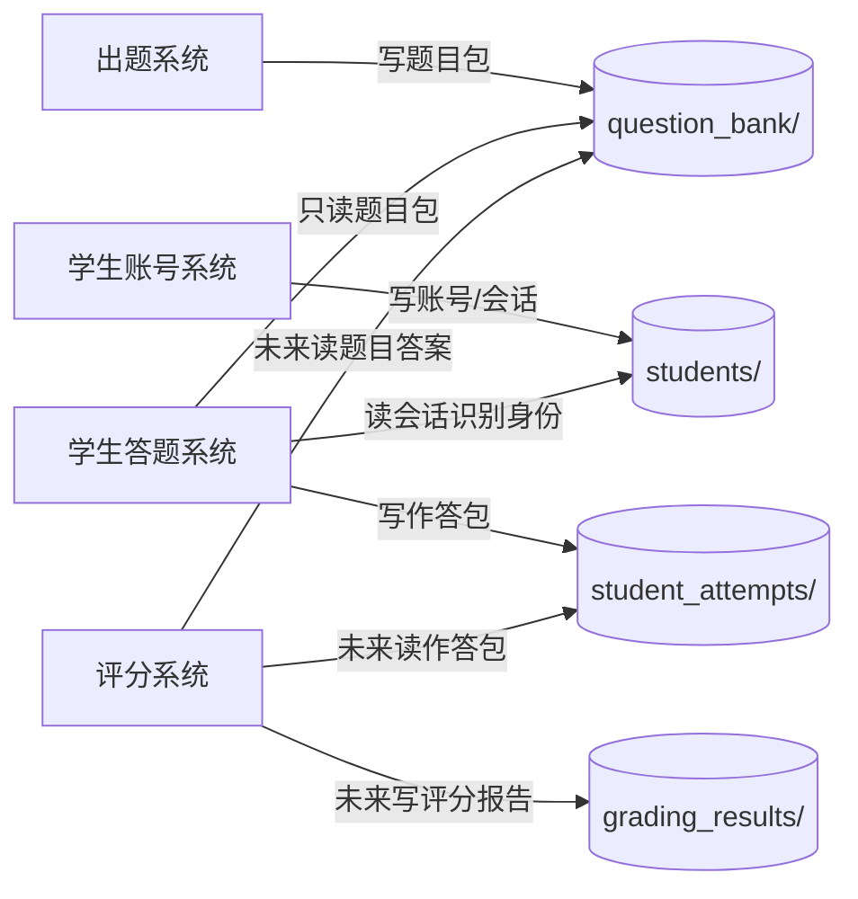
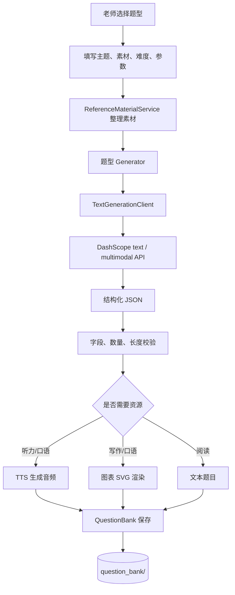
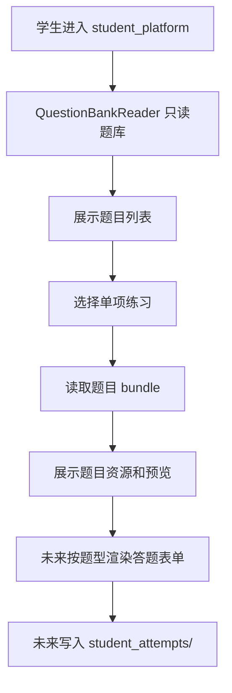
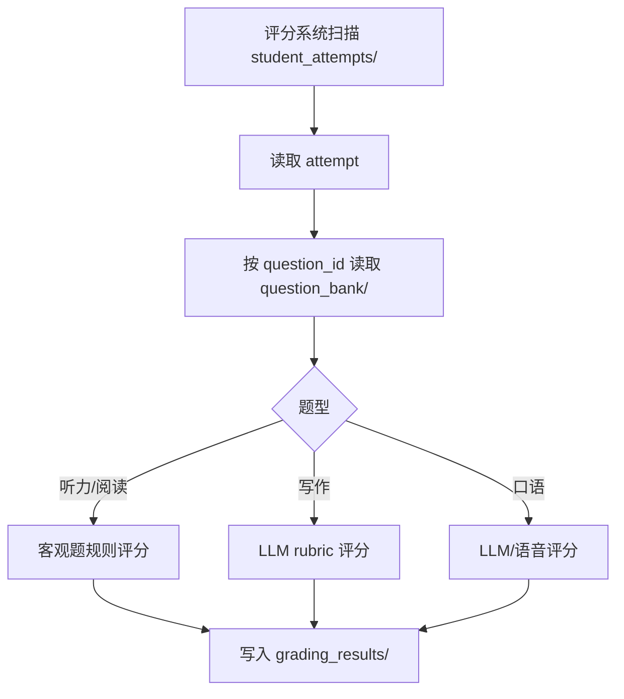

# TestDaF 本地模拟考试系统

本仓库正在从“单一出题 Web 应用”演进为四个通过文件通信的本地系统：

- **出题系统**：生成 TestDaF 听力、阅读、写作、口语题目包，写入 `question_bank/`。
- **学生账号系统**：学生自助注册、登录，写 `students/`（账号、会话）。
- **学生答题系统**：只读 `question_bank/`，读 `students/sessions/` 识别登录身份，写 `student_attempts/`。
- **评分系统**：未来只读 `question_bank/` 和 `student_attempts/`，写入 `grading_results/`。

如果需要让人或 LLM 快速理解代码结构，请先阅读：[架构概览](docs/architecture-overview.md)。

## 系统交互逻辑



三个系统不通过 Web API 互相调用，通信边界是文件目录和 JSON。

## 当前仓库结构

```text
testdaf_platform/             # 出题系统，当前已完成主要功能
student_account_platform/     # 学生账号系统：注册/登录/会话
student_platform/             # 学生答题系统骨架，已可只读 question_bank 展示题目
scoring_platform/             # 评分系统占位，等待学生作答协议稳定
shared/                       # 多系统共享的文件工具和题库只读 reader
docs/                         # 架构说明、路线图、题型分析
scripts/                      # 诊断脚本
tests/                        # 回归测试
question_bank/                # 本地生成题库，不纳入版本控制
student_attempts/             # 学生作答目录
students/                     # 学生账号与会话数据，不纳入版本控制
grading_results/              # 未来评分结果目录
```

## 启动方式

### 出题系统

```bash
uv sync
uv run python main.py
```

默认访问：

```text
http://127.0.0.1:8000/
```

macOS / Windows 仍可使用根目录的一键启动脚本：

```text
start_mac.command
start_windows.bat
```

### 学生账号系统

```bash
uv sync
uv run python student_account_platform/account_main.py
```

默认访问：

```text
http://127.0.0.1:8002/
```

学生在此自助注册、登录，会话 Cookie 由账号系统颁发，答题系统（8001）通过只读 `students/sessions/` 识别登录身份。

### 学生答题系统

```bash
uv sync
uv run python student_main.py
```

默认访问：

```text
http://127.0.0.1:8001/
```

当前学生系统只读题库并展示练习入口，作答保存协议尚未最终固定。

### 评分系统

评分系统目前只保留边界说明，见 [scoring_platform/README.md](scoring_platform/README.md)。

## 出题系统主链路



## 学生答题系统主链路



## 评分系统预期链路



## API Key 和模型

可以在出题系统页面表单中填写阿里云百炼 API Key，也可以设置环境变量：

```bash
export DASHSCOPE_API_KEY=YOUR_API_KEY
```

模型配置位于 `testdaf_platform/config.py`：

```python
QWEN_TEXT_MODEL = "qwen3.7-plus"
QWEN_TTS_MODEL = "qwen3-tts-flash"
```

文本生成必须走 `TextGenerationClient`。`qwen3.7-plus` 会自动使用 DashScope `multimodal-generation`。

## 出题系统能力

| 模块 | 题型 | 主要产物 |
| --- | --- | --- |
| 听力 | Aufgabe 1 | 双人校园对话、8 道短答题、分段 TTS、完整音频 |
| 听力 | Aufgabe 2 | 主持人与两位嘉宾访谈、10 道 Richtig/Falsch、完整音频 |
| 听力 | Aufgabe 3 | 专家访谈、7 道短答题、完整音频 |
| 阅读 | Aufgabe 1 | A-H 短文本、10 个人物需求、匹配答案 |
| 阅读 | Aufgabe 2 | 中长阅读文本、10 道 A/B/C 单选题 |
| 阅读 | Aufgabe 3 | 长阅读文本、10 道 Ja/Nein/Text sagt dazu nichts |
| 写作 | Aufgabe 1 | 写作题干、任务要求、SVG 图表 |
| 口语 | Aufgabe 1-7 | 口语任务、引子语音、可选图表 |
| 口语 | Test Set | 7 题套卷 |

## 题库文件结构

```text
question_bank/
  listening/
  reading/
  writing/
  speaking/
```

每个题目包至少包含：

```text
manifest.json
preview.md
reference_sources.json  # 如果使用网页参考素材
```

不同模块会额外保存文本、答案、音频、图表或上传图片等资源。

## 开发约束

- 出题系统写 `question_bank/`。
- 学生账号系统写 `students/`（账号与会话），是 `students/` 的唯一写者。
- 学生答题系统只读 `question_bank/` 和 `students/sessions/`（识别登录身份），写 `student_attempts/`。
- 评分系统未来只读 `question_bank/` 和 `student_attempts/`，写 `grading_results/`。
- 学生系统不要 import 出题生成器。
- 评分系统不要调用出题或学生 Web 路由。
- 共享文件读写能力放在 `shared/`。
- 新增 JSON 写入应使用原子写策略。

## 常用验证

```bash
uv run python -m compileall testdaf_platform student_platform student_account_platform shared tests scripts
uv run python -m unittest discover -s tests -v
uv run python scripts/check_dashscope_model.py --model qwen3.7-plus --compare qwen-plus
```
