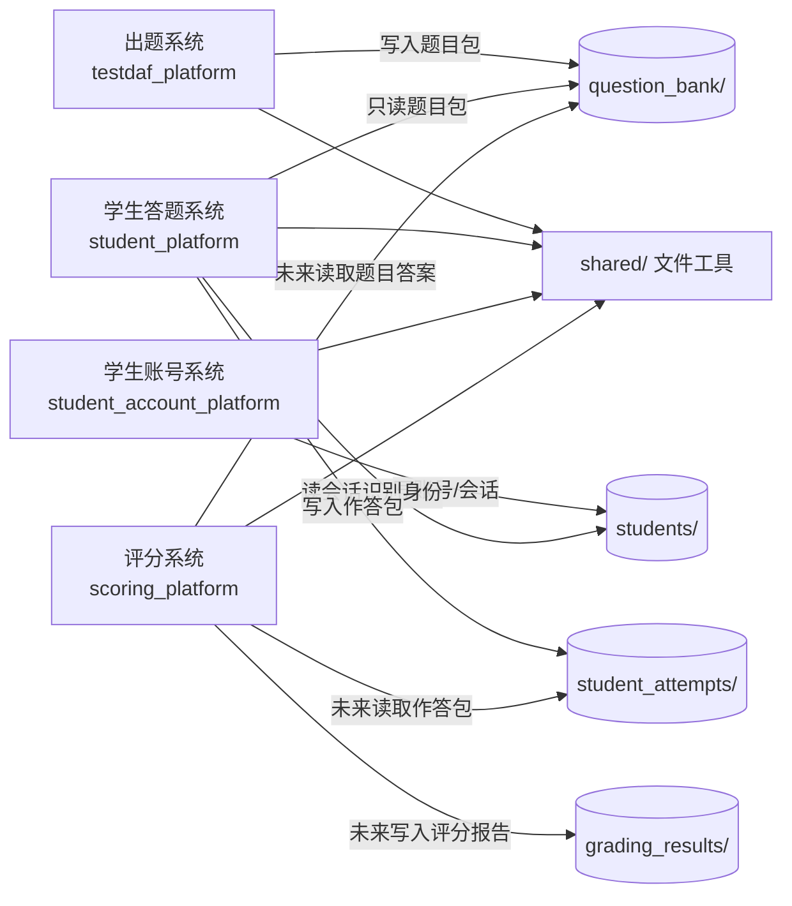
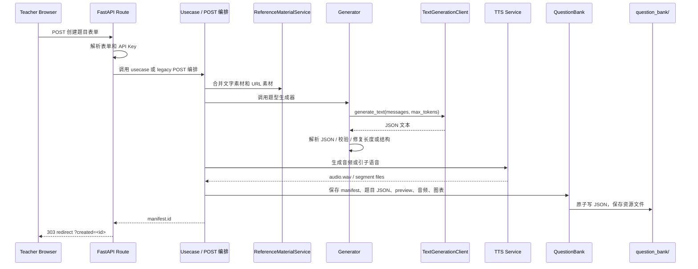
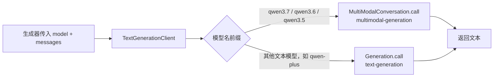

# TestDaF 平台架构概览

本文档用于让人或 LLM 在不拉取/扫描全仓库的情况下，快速理解当前系统边界、核心调用链和分析入口。

## 项目定位

- 本项目是本地优先的 TestDaF 模拟考试系统，正在拆分为出题、学生账号、学生答题、评分四个本地系统。
- 出题系统负责生成题目包并保存到 `question_bank/`。
- 学生账号系统负责注册/登录/会话，写 `students/`，是 `students/` 的唯一写者。
- 学生答题系统只读 `question_bank/`，读 `students/sessions/` 识别登录身份，保存作答到 `student_attempts/`。
- 评分系统未来读取 `student_attempts/` 和 `question_bank/`，输出到 `grading_results/`。
- 当前不是多租户系统，也没有数据库；登录态基于本地文件会话（`students/sessions/`），无外部依赖。

## 快速入口

- 应用入口：[web.py](file:///Users/bytedance/德语转语音/testdaf_platform/web.py)
- 运行入口：[main.py](file:///Users/bytedance/德语转语音/main.py)
- 配置入口：[config.py](file:///Users/bytedance/德语转语音/testdaf_platform/config.py)
- 题库存储：[question_bank.py](file:///Users/bytedance/德语转语音/testdaf_platform/storage/question_bank.py)
- 统一文本模型客户端：[text_generation.py](file:///Users/bytedance/德语转语音/testdaf_platform/services/text_generation.py)
- 题库管理路由：[teacher_manage.py](file:///Users/bytedance/德语转语音/testdaf_platform/routers/teacher_manage.py)
- 第一个 usecase 样板：[create_listening_aufgabe_1.py](file:///Users/bytedance/德语转语音/testdaf_platform/usecases/create_listening_aufgabe_1.py)
- 学生系统入口：[student_platform/web.py](file:///Users/bytedance/德语转语音/student_platform/web.py)
- 学生账号系统入口：[student_account_platform/web.py](file:///Users/bytedance/德语转语音/student_account_platform/web.py)
- 共享题库只读 reader：[reader.py](file:///Users/bytedance/德语转语音/shared/question_bank/reader.py)
- 评分系统占位：[scoring_platform/README.md](file:///Users/bytedance/德语转语音/scoring_platform/README.md)
- 架构拆路由计划：[route-splitting-plan.md](file:///Users/bytedance/德语转语音/docs/route-splitting-plan.md)

## 目录职责

```text
testdaf_platform/
  web.py                 # FastAPI app 装配、页面路由、尚未迁移的出题 POST 编排
  config.py              # 项目路径、模型名、DashScope base URL、音色列表
  routers/               # 已拆分的路由模块，目前包含 teacher_manage
  usecases/              # 应用业务编排层，目前包含 Listening Aufgabe 1 样板
  services/              # 生成器、TTS、导出、参考素材、后台任务、配置存储
  storage/               # 本地题库文件系统读写
  templates/             # Jinja2 页面模板
  static/                # CSS 等静态资源
student_platform/        # 独立学生答题系统，只读 question_bank + students/sessions
student_account_platform/  # 独立学生账号系统，写 students/（账号/会话）
scoring_platform/        # 评分系统占位，等待学生作答协议稳定
shared/                  # 多系统共享的文件工具、路径保护、题库只读 reader
tests/                   # 回归测试和架构关键点测试
scripts/                 # 诊断脚本，例如 DashScope 模型可用性检查
docs/                    # 架构、路线图和业务分析文档
```

## 总体架构图



## 核心生成链路



## 文本模型调用规则

`TextGenerationClient` 是所有纯文本生成请求的统一入口。不要在新代码里直接调用 `dashscope.Generation.call`。



关键原因：

- 阿里云文档中 `qwen3.7-plus` 属于多模态接口路径，即使只输入文本，也应走 `multimodal-generation`。
- `qwen-plus` 这类模型走普通 `text-generation`。
- 如果把 `qwen3.7-plus` 发到 `Generation.call` 对应的纯文本 endpoint，会返回 `400 InvalidParameter url error`。

可用性诊断：

```bash
uv run python scripts/check_dashscope_model.py --model qwen3.7-plus --compare qwen-plus
```

## 题库存储结构

题库默认保存在项目根目录的 `question_bank/`，按模块和题型分层：

```text
question_bank/
  listening/
    aufgabe_1/
      q_<timestamp>_<id>/
        manifest.json
        transcript.txt
        segments.json
        questions.json
        audio.wav
        audio_segments/
        preview.md
  reading/
  writing/
  speaking/
  .trash/
```

存储约束：

- `QuestionBank` 负责路径校验，防止资源路径逃逸出题目目录。
- JSON 写入使用临时文件 + `replace()`，避免半写入 JSON。
- 垃圾箱恢复如果原路径已有题目，不会覆盖现有题目，会返回冲突错误。
- `/question-bank` 目前仍作为静态目录挂载，适合本地单人使用；如果部署给多人，需要补访问控制。

## 主要模块说明

| 模块 | 主要文件 | 说明 |
| --- | --- | --- |
| Web 装配 | `web.py` | 创建 FastAPI app、挂载静态资源、注册 router、保留大部分题型页面和创建接口 |
| 题库管理路由 | `routers/teacher_manage.py` | 管理、删除、恢复、改名、导出下载 |
| Usecase 样板 | `usecases/create_listening_aufgabe_1.py` | Listening Aufgabe 1 的业务编排样板 |
| 文本生成统一入口 | `services/text_generation.py` | 根据模型类型选择 DashScope text 或 multimodal API |
| 听力生成 | `services/listening_aufgabe_*.py` | 生成听力脚本、segments、问题，并做长度/结构校验 |
| 阅读生成 | `services/reading.py` | 生成阅读 1/2/3，包含长度修复逻辑 |
| 写作生成 | `services/writing.py` | 生成写作题、图表规格和 SVG 渲染 |
| 口语生成 | `services/speaking.py` | 生成口语 1-7 和套卷内容 |
| TTS | `services/tts.py`、`services/multi_speaker_tts.py` | 生成分段音频、拼接 WAV、下载音频 URL |
| 导出 | `services/export_service.py` | 从题目包导出 Word / PDF |
| 存储 | `storage/question_bank.py` | 本地题库 manifest、资源文件、垃圾箱、加载 bundle |

## 当前已完成的架构改造

- 代码库已显式拆出 `testdaf_platform/`、`student_platform/`、`scoring_platform/`、`shared/`。
- 学生系统已有独立 FastAPI 入口，可只读 `question_bank/` 展示题目包。
- 评分系统已有占位说明，等待学生作答协议稳定后实现。
- `shared/` 已提供原子 JSON、路径保护、题库只读 reader。
- 题库管理路由已从 `web.py` 拆到 `routers/teacher_manage.py`。
- `Listening Aufgabe 1` 创建流程已抽成 usecase 样板。
- 文本模型调用已统一到 `TextGenerationClient`。
- 导出文件名已加入题目 ID 和随机后缀，避免同名覆盖。
- `/downloads` 不再作为静态目录公开挂载。
- TTS 音频下载有超时和重试。
- 题库 JSON 写入更安全，恢复垃圾箱不覆盖现有题目。

## 当前仍需注意的架构风险

- `web.py` 仍包含大量页面路由和大部分题型 POST 编排，后续应继续迁移到 `routers/` 和 `usecases/`。
- `QuestionBank` 仍承担保存、读取、预览、垃圾箱、重命名等多种职责，后续可拆为 repository / asset store / trash service。
- 学生系统当前还只是题目浏览和练习入口骨架，作答保存协议尚未固定。
- 评分系统当前只保留边界说明，尚未实现。
- 多数题型生成结果仍以裸 `dict` 在服务层、存储层、导出层传递，字段变更容易产生隐式耦合。
- `JobManager` 是内存态，重启后口语生成任务状态会丢失。
- `/question-bank` 静态挂载仍暴露完整题库资源，部署到多人环境前必须增加访问控制。

## 给 LLM 的分析建议

建议优先读取：

1. `docs/architecture-overview.md`
2. `README.md`
3. `README.md`
4. `student_platform/web.py`
5. `shared/question_bank/reader.py`
6. `testdaf_platform/web.py`
7. `testdaf_platform/services/text_generation.py`
8. `testdaf_platform/usecases/create_listening_aufgabe_1.py`
9. `testdaf_platform/storage/question_bank.py`
10. 具体要改哪个题型，再读取对应 `services/<题型>.py` 和 `templates/teacher_*.html`

不建议默认读取或分析：

- `question_bank/`：本地生成题库数据，不是源码。
- `downloads/`：导出产物，不是源码。
- `.venv/`、`__pycache__/`、`.DS_Store`：运行环境或缓存。
- `uv.lock`：除非正在分析依赖版本，否则不要作为架构输入。

## 给后续改造的约束

- 新的文本生成调用必须走 `TextGenerationClient`。
- 新增题型创建流程应优先按 `CreateListeningAufgabe1UseCase` 的模式抽 usecase。
- 学生系统只读 `question_bank/` 和 `students/sessions/`，不要 import 出题生成器或写题库。
- 学生账号系统是 `students/` 的唯一写者；答题系统只读 `students/sessions/`，不要写账号或会话。
- 评分系统未来只读 `question_bank/` 和 `student_attempts/`，只写 `grading_results/`。
- 新增管理类路由应放入 `routers/`，不要继续塞进 `web.py`。
- 新增题库 JSON 写入必须复用 `QuestionBank._write_json()` 或同等原子写入策略。
- 不要重新公开挂载 `/downloads`。
- 涉及真实模型调用的测试应先跑 `scripts/check_dashscope_model.py`。

## 常用验证命令

```bash
uv run python -m compileall testdaf_platform student_platform student_account_platform shared tests scripts
uv run python -m unittest discover -s tests -v
uv run python scripts/check_dashscope_model.py --model qwen3.7-plus --compare qwen-plus
```
